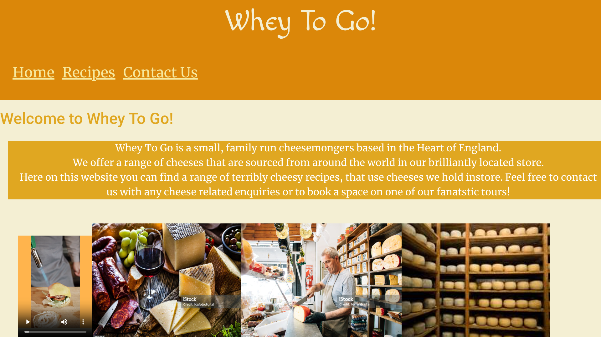
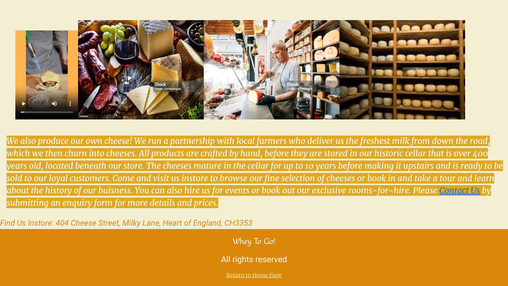
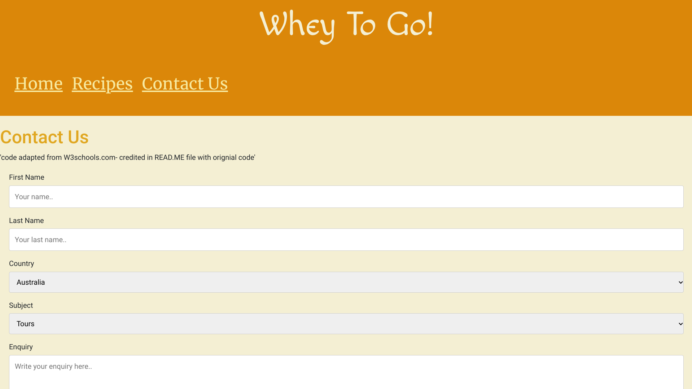
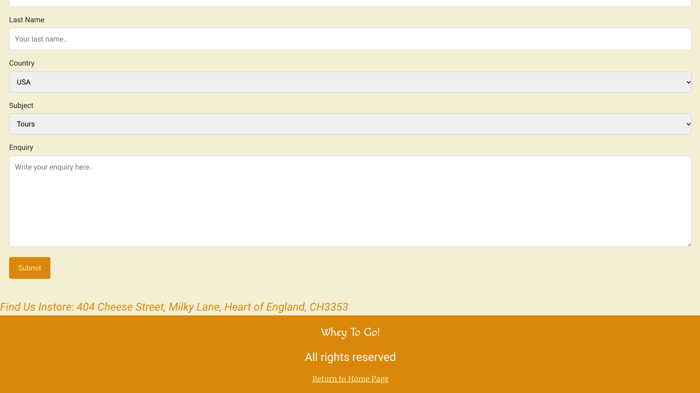
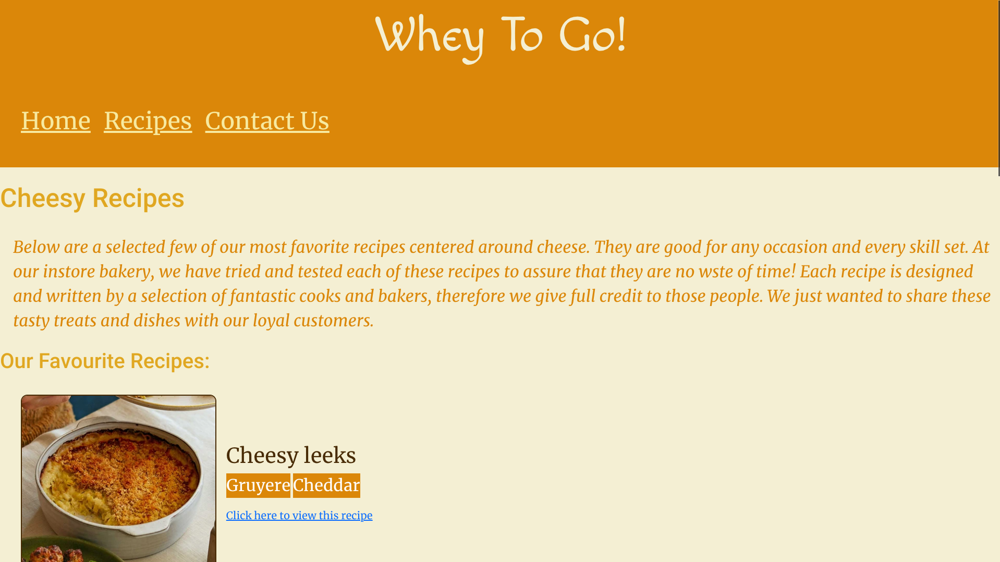
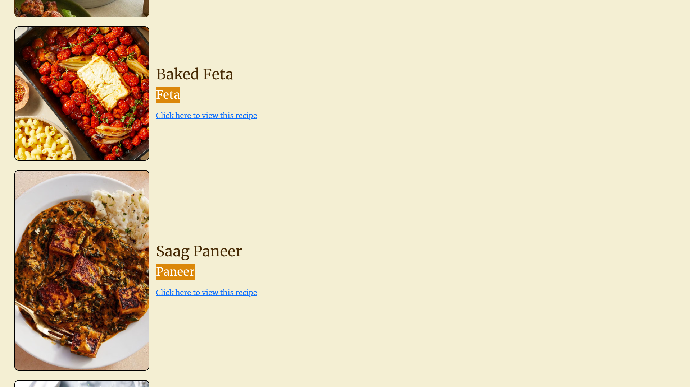
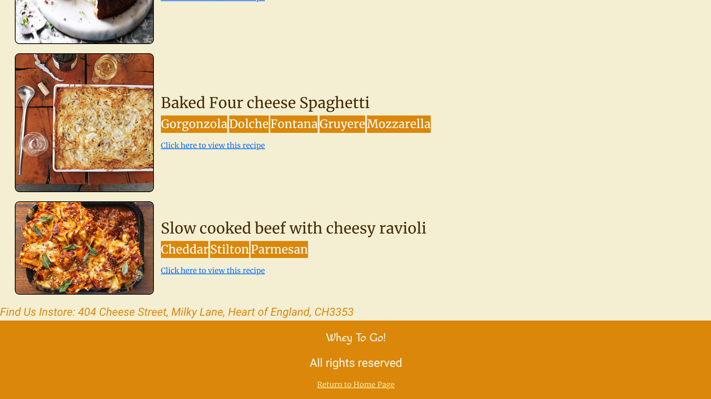

# written with Markdown

# UX
  ## Project Goals
   Whey to Go! - a website where users can access a variety of information on cheeses from around the world. It proposes to spread knowledge, inspiration and a new found appreciation for all things cheesy with suggested tatsy cheesy recipes. Users can also fill in an enquiry form so that they can contact us

  # Player and Developer Goals
   The website allows users to: 
   * be informed about the buisness that the website is marketing 
   * contact the business about bookings and events as they are advertised 
   * scroll and use the navigation bar, located at the top of each page to discover new cheesy things
   * be provided clickable external links to visit the origins of each recipe where you can find more suggestions from the writers 

  ## User Stories
   As a visitor to the website I want:
    - a website that is easy to navigate and change pages efficiently
    - to be able to easily find important information about Whey to Go! such as the location and adress of the shop to see if it is local or contact information  
    - to learn more about the history of the business/ histric location 
    - to find recipes for the cheeses that I have purchased from Whey to Go!

   As the owner of Whey to Go! I want:
    - to attract neww customers by having a website to represent the store and advertise to new customers
    - to inform customers about the ethos, history and what the businesses have to offer to them

   As the devolper of a website I want:
    - to create a website that aligns with the owners goals and users needs
    - to make the website attractive and easy to navigate so that customers spend more time using it and become a customer of the business

    
  ## Design Choices
   The website uses the same colour pallete and logo as the buisness that it was created for to maintain brand consitency. It also uses colours that are often associated with cheeses like yellow, orange and cream.

  ## Wireframes
    

  ## Credits
   ### code
   Contact us form code copied from w3schools:
 https://www.w3schools.com/howto/howto_css_contact_form.asp 

  <form action="action_page.php">

    <label for="fname">First Name</label>
    <input type="text" id="fname" name="firstname" placeholder="Your name..">

    <label for="lname">Last Name</label>
    <input type="text" id="lname" name="lastname" placeholder="Your last name..">

    <label for="country">Country</label>
    <select id="country" name="country">
      <option value="australia">Australia</option>
      <option value="canada">Canada</option>
      <option value="usa">USA</option>
    </select>

    <label for="subject">Subject</label>
    <textarea id="subject" name="subject" placeholder="Write something.." style="height:200px"></textarea>

    <input type="submit" value="Submit">

  </form>

 
   
 Colums fetched from: https://getbootstrap.com/docs/5.3/layout/grid/
 

  

    

    

    

      Column
    

    

      Column
    

  

   ### media
    All images extracted from Shutterstock.com and iStock.com

  ## Deployment
   To set up project on a local device, open this link in a web browser:

  ## Testing
   ### HTML code validated using: https://validator.w3.org/
    
    
    

   ### CSS code validated using: https://jigsaw.w3.org/css-validator/
    

   ### Final website screenshots 
   
   
   
   
   
   
   
