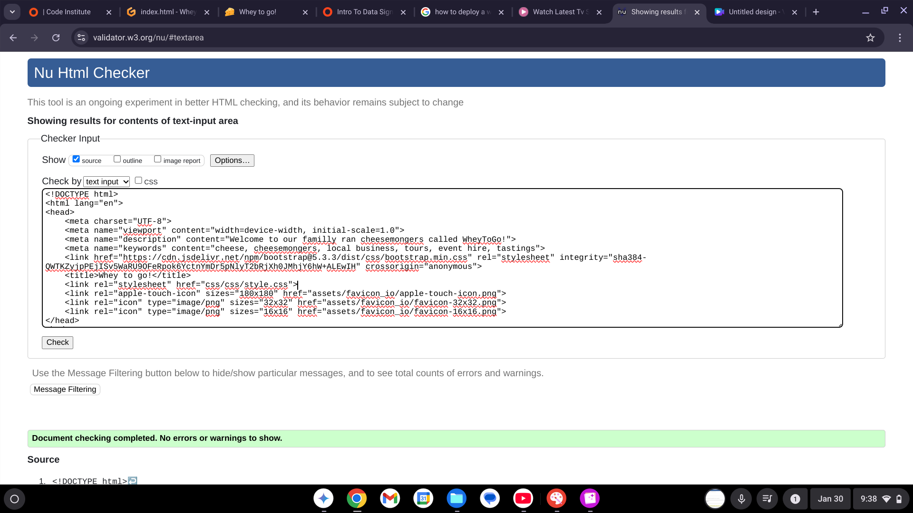
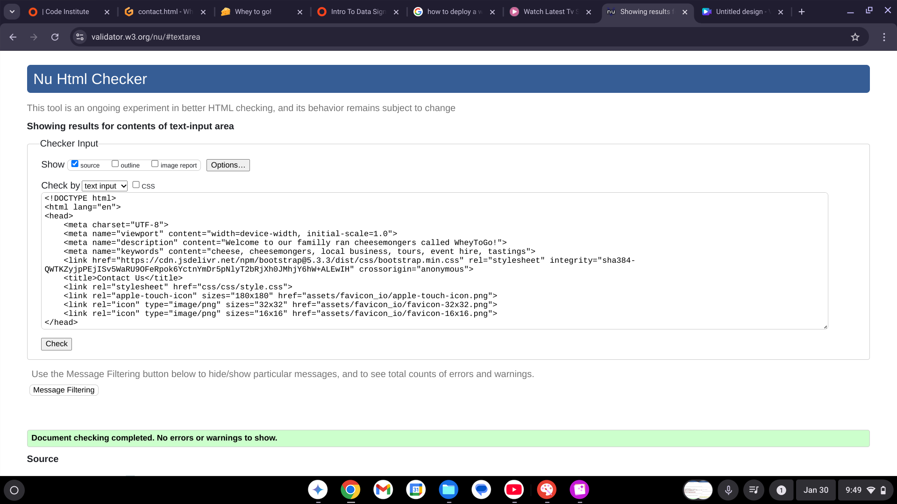
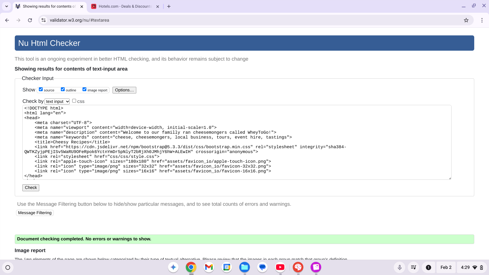
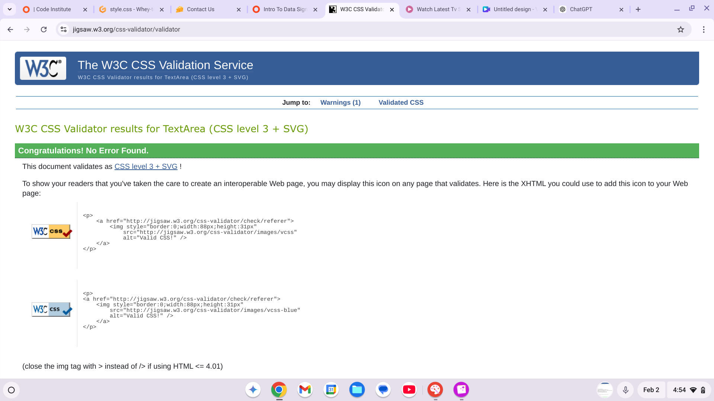

,mbvvvgvvvvvvvvvvvvvvvvvvvvvvvvv# written with Markdown

# UX
  ## Project Goals
   Whey to Go! - a website where users can access a variety of information on cheeses from around the world. It proposes to spread knowledge, inspiration and a new found appreciation for all things cheesy with suggested tatsy cheesy recipes. Users can also fill in an enquiry form so that they can contact us

  # Player and Developer Goals
   The website allows users to: 
   * be informed about the buisness that the website is marketing 
   * contact the business about bookings and events as they are advertised 
   * scroll and use the navigation bar, located at the top of each page to discover new cheesy things
   * be provided clickable external links to visit the origins of each recipe where you can find more suggestions from the writers 

  ## User Stories
   As a visitor to the website I want:
    - a website that is easy to navigate and change pages efficiently
    - to be able to easily find important information about Whey to Go! such as the location and adress of the shop to see if it is local or contact information  
    - to learn more about the history of the business/ histric location 
    - to find recipes for the cheeses that I have purchased from Whey to Go!

   As the owner of Whey to Go! I want:
    - to attract neww customers by having a website to represent the store and advertise to new customers
    - to inform customers about the ethos, history and what the businesses have to offer to them

   As the devolper of a website I want:
    - to create a website that aligns with the owners goals and users needs
    - to make the website attractive and easy to navigate so that customers spend more time using it and become a customer of the business

    
  ## Design Choices
   The website uses the same colour pallete and logo as the buisness that it was created for to maintain brand consitency. It also uses colours that are often associated with cheeses like yellow, orange and cream.

  ## Wireframes
    https://balsamiq.cloud/swmmev/prr0ye8/r632F

  ## Credits
   ### code
   Contact us form code copied from w3schools:
 https://www.w3schools.com/howto/howto_css_contact_form.asp 
   
   

   <form action="action_page.php">

    <label for="fname">First Name</label>
    <input type="text" id="fname" name="firstname" placeholder="Your name..">

    <label for="lname">Last Name</label>
    <input type="text" id="lname" name="lastname" placeholder="Your last name..">

    <label for="country">Country</label>
    <select id="country" name="country">
      <option value="australia">Australia</option>
      <option value="canada">Canada</option>
      <option value="usa">USA</option>
    </select>

    <label for="subject">Subject</label>
    <textarea id="subject" name="subject" placeholder="Write something.." style="height:200px"></textarea>

    <input type="submit" value="Submit">

  </form>

 
   
 Colums fetched from: https://getbootstrap.com/docs/5.3/layout/grid/
 

  

    

    

    

      Column
    

    

      Column
    

  

   ### media
    All images extracted from Shutterstock.com and iStock.com

  ## Deployment
   [To set up project on a local device, open this link in a web browser] (https://studious-space-guide-5gxg6p5jjwv6c7xxj-8000.app.github.dev/recipes.html)
    * Install code steps:
 1. Install Git
    Download and install Git from the official Git website (https://git-scm.com/).
 2. Clone the Repository
    Open a Terminal and navigate to the directory and clone repo URl: https://remyvts11.github.io/Whey-to-go-pm1/
 3. Run the Project via the terminal by typing command python3 -m http.server

 * Run code steps:
  1. Either install the code to your device or clone it following the above steps
  2. There are no necissairy dependancies to install for Yes Chef!
  3. To run the 

 * Clone code steps:
  1. Have git installed to your computer 
  2. Go to the git repository and select the clone button
  3. Copy the clone command link
  4. From a terminal window, change to the local directory where you want to clone your repository
  5. Paste the clone command link into the terminal and press Enter.

  ## Testing

   ### HTML code validated using: https://validator.w3.org/
   
   
   

   ### CSS code validated using: https://jigsaw.w3.org/css-validator/
   

   ### Final website screenshots 
   
   
   
   
   
   
   

   ### Testing Table
    Expected - Site is expected to take user to recipe page when recipe in the nav bar is clicked
    Tested   - Tested the site by clicking 'recipes'
    Result   - Site acted as expected and took user to Recipe page

    Expected - Site is expected to take user to Contact page when 'contact us' in the nav bar is clicked
    Tested   - Tested the site by clicking 'contact us'
    Result   - Site acted as expected and took user to contact page

    Expected - Site is expected to take user to another site via the external links in recipe page
    Tested   - Tested the site by clicking all external recipe links
    Result   - Site acted as expected and took user to the linked sites

    Expected - Site is expected to take user bcak to home page when they scroll to bottom of any page on the site
    Tested   - Tested the site by scrolling to the bottom of each page and clicking the home link
    Result   - Site acted as expected and took user bcak to the home link 

    Expected - Site is expected to play video when loaded
    Tested   - Tested the site by loading site 
    Result   - Site acted as expected and played the video

    Expected - Site is expected to provide audio controls for the video
    Tested   - Tested the site by turning up the video volume/ muting video audio
    Result   - Site acted as expected and turned up the volume/ muted the video audio
    
